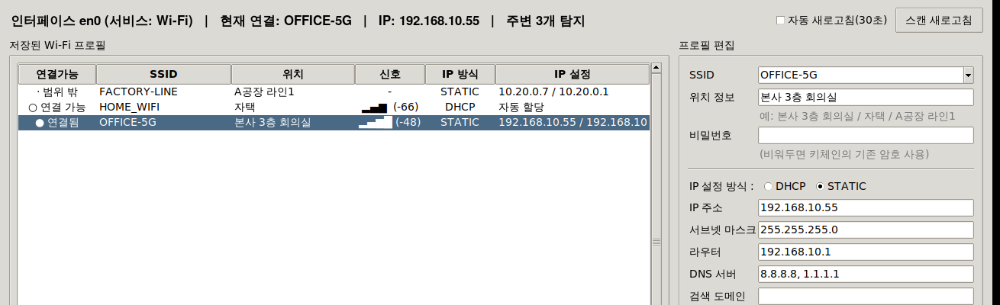
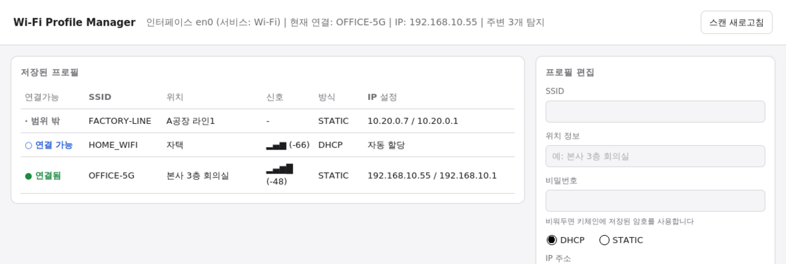

# Wi-Fi Profile Manager for macOS

[](https://github.com/OWNER/wifi-profile-manager/actions/workflows/build.yml)
[](LICENSE)
[](#)

SSID별 IP 설정(**DHCP / STATIC**)과 **위치 정보**를 저장해두고, 주변 스캔 결과와 대조해
**연결 가능 여부**를 표시한 뒤, 선택한 네트워크에 접속하면서 저장된 IP 설정을
자동으로 적용하는 macOS 앱입니다.



Tk가 정상 동작하지 않는 환경에서는 **브라우저 UI로 자동 전환**됩니다.



> `OWNER` 부분은 본인 GitHub 계정명으로 바꿔주세요.

---

## 설치

### 릴리스에서 내려받기

[Releases](../../releases) 에서 zip을 받아 압축을 푼 뒤:

```bash
xattr -dr com.apple.quarantine "WiFi Profile Manager.app"
cp -R "WiFi Profile Manager.app" /Applications/
```

### 소스에서 빌드

```bash
git clone https://github.com/OWNER/wifi-profile-manager.git
cd wifi-profile-manager
./scripts/build_app.sh      # dist/WiFi Profile Manager.app 생성
./scripts/install.sh        # /Applications 설치 + 격리 해제 + CLI 등록
```

파이썬까지 내장한 완전 독립형(약 30MB)이 필요하면:

```bash
./scripts/build_standalone.sh
```

> Windows에서 올리는 방법은 [docs/push-from-windows.md](docs/push-from-windows.md) 참고.

## 저장소 구조

```
src/wifi_profile_manager.py   본체 (GUI · CLI)
src/webui.py                  브라우저 UI 서버 (Tk 미사용)
scripts/build_app.sh          경량 .app 번들 빌드
scripts/build_standalone.sh   PyInstaller 완전 독립형 빌드
scripts/install.sh            설치 + 격리 해제 + CLI 등록
scripts/launcher.sh           번들 실행 런처 (python3 자동 탐색)
assets/AppIcon.icns           앱 아이콘 (assets/make_icon.py 로 재생성)
.github/workflows/build.yml   CI — 검사 · 번들 빌드 · 태그 시 릴리스
.gitattributes                줄바꿈 정책 (셸/파이썬은 항상 LF)
docs/push-from-windows.md     Windows에서 푸시하는 방법
```

## 기여

이슈와 PR을 환영합니다. PR을 열면 CI가 파이썬 문법, 셸 문법,
IP 검증 로직, 웹 UI API를 자동으로 검사합니다.

`v1.2.0` 형태로 태그를 푸시하면 두 종류의 `.app` 이 빌드되어 릴리스에 첨부됩니다.

## 라이선스

[MIT](LICENSE)

---

## 사용법

### 화면 구성

| 영역 | 설명 |
|---|---|
| 상단 | Wi-Fi 인터페이스(en0), 서비스명, 현재 연결 SSID/IP, 탐지된 AP 수 |
| 좌측 목록 | 저장된 프로필 + `● 연결됨` / `○ 연결 가능` / `· 범위 밖`, **위치**, 신호세기, IP 방식 |
| 우측 폼 | SSID, **위치 정보**, 비밀번호, **DHCP / STATIC 선택**, STATIC일 때 IP·서브넷·라우터, DNS·검색도메인 |
| 하단 | 실행 로그 (단계별 성공/실패 원인) |

### 프로필 등록

1. **새로 만들기** 클릭
2. SSID 입력 (드롭다운에 스캔된 SSID가 채워짐)
3. **위치 정보** 입력 — 어디에 있는 네트워크인지 메모 (예: `본사 3층 회의실`, `자택`, `A공장 라인1`)
4. 비밀번호 입력
5. **DHCP** 또는 **STATIC** 선택 — STATIC이면 IP/서브넷/라우터 입력칸이 활성화됨
6. **저장**

현재 접속 중인 설정을 그대로 프로필화하려면 **[현재 연결된 SSID 가져오기]** 버튼 사용.

### 연결

목록에서 프로필 선택 → **[선택한 Wi-Fi 연결]** (또는 항목 더블클릭)

```
[1/3] SSID 접속        networksetup -setairportnetwork en0 <SSID> <PW>
[2/3] IP 설정 적용     DHCP  : networksetup -setdhcp "Wi-Fi"
                      STATIC: networksetup -setmanual "Wi-Fi" <IP> <MASK> <ROUTER>
                      공통  : -setdnsservers / -setsearchdomains
[3/3] 결과 확인        ipconfig getifaddr en0
```

2단계는 관리자 권한이 필요합니다. 여러 명령을 `&&` 로 묶어 **암호 입력창이 1회만** 뜨도록 처리했습니다.

### 터미널(CLI) 사용

```bash
wifi-profile --list                # 프로필 + 연결 가능 여부
wifi-profile --scan                # 주변 Wi-Fi 스캔
wifi-profile --connect "MyOffice"  # 접속 + IP 설정 적용
wifi-profile --info                # 현재 상태
```

`scripts/install.sh` 가 `/usr/local/bin/wifi-profile` 을 등록합니다.
직접 실행하려면 `python3 src/wifi_profile_manager.py --list`.

---

## 저장 위치 / 보안

- 프로필 : `~/.wifi_profile_manager/profiles.json` (권한 `0600`)
- Wi-Fi 비밀번호 : **파일이 아닌 macOS 키체인**
  (`security add-generic-password -s wifi-profile-manager:<SSID>`)
- 완전 제거 :
  ```bash
  rm -rf ~/.wifi_profile_manager
  rm -rf "/Applications/WiFi Profile Manager.app"
  sudo rm -f /usr/local/bin/wifi-profile
  ```

## 입력 검증

- IPv4 형식 검사, 서브넷 마스크 유효성(연속 비트) 검사
- **라우터가 IP/마스크와 같은 대역인지** 검사 → 잘못된 게이트웨이로 인한 통신 두절 방지
- DNS 항목별 IPv4 검사

## 문제 해결 — 창은 뜨는데 내용이 비어 있을 때

### 원인 : macOS 내장 Tk 8.5 렌더링 버그

`/usr/bin/python3` 가 쓰는 **Tk 8.5** 는 최신 macOS에서 창은 열리지만
내부 위젯이 그려지지 않는 것으로 알려져 있습니다. 테마 변경·강제 리드로우로도
해결되지 않는 경우가 많습니다.

### 해결 : 브라우저 UI 모드 (v1.2.0부터 자동)

**Tk 8.6 미만이 감지되면 앱이 자동으로 브라우저 UI로 전환**합니다.
Tk를 전혀 사용하지 않고 로컬 웹서버(127.0.0.1)를 띄운 뒤 기본 브라우저를 열며,
기능은 GUI와 완전히 동일합니다.

수동 실행:

```bash
"/Applications/WiFi Profile Manager.app/Contents/MacOS/WiFiProfileManager" --web
```

- 주소는 `http://127.0.0.1:<임의포트>/?t=<토큰>` 형태로, **로컬호스트 + 토큰 인증** 이므로
  외부에서 접근할 수 없습니다. (토큰 없는 요청은 403)
- 표준 라이브러리만 사용하며 추가 설치가 필요 없습니다.
- 스크립트는 ES5로 작성되어 구형 Safari에서도 동작합니다.
- **종료** : 터미널 실행 시 `Control-C`, Finder 실행 시 Dock 아이콘 우클릭 → 종료.

### Tk GUI를 계속 쓰고 싶다면

Tk 8.6 이상을 설치하면 원래 GUI로 실행됩니다.

```bash
brew install python-tk      # 또는 python.org 설치본 사용
```

`--tk` 옵션을 주면 Tk 8.5에서도 강제로 Tk GUI를 실행합니다.

### 그 외 확인

```bash
... --doctor                               # 실행 환경 진단
cat ~/.wifi_profile_manager/launcher.log   # 선택된 python3
cat ~/.wifi_profile_manager/app.log        # 파이썬 예외
xattr -dr com.apple.quarantine "/Applications/WiFi Profile Manager.app"   # Gatekeeper 차단 해제
```

---

## 알아둘 점

- **macOS 14.4 이상**에서 `airport` CLI가 제거되어 `system_profiler SPAirPortDataType` 로 폴백합니다.
  스캔 목록이 비면 *시스템 설정 → 개인정보 보호 및 보안 → 위치 서비스* 에서
  이 앱(또는 터미널)의 위치 권한을 허용하세요.
  권한이 없어도 **저장된 프로필 목록과 연결 기능 자체는 정상 동작**합니다.
- 회사 MDM 정책으로 네트워크 설정이 잠긴 기기에서는 IP 변경이 거부될 수 있습니다.
- 애드혹 서명이므로 Apple 공증(notarization)은 되어 있지 않습니다. 사내/개인 배포 전제입니다.

